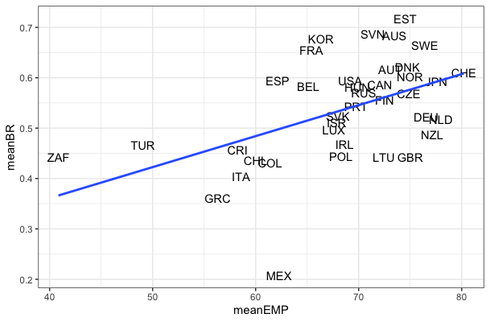

```{r setup, include=FALSE}
knitr::opts_chunk$set(echo = TRUE)
```

# NEW PAPER IDEAS

## Not in a particular order

1. Estimating personal or household wealth based on machine learning via instagram photos.
Children and/or close relatives of reach people tend to show off by displaying luxury items such as yachts, cars, watches or jewellery on their instagram photos. We collects the photos, train a ML program and try to estimate the wealth level of the household. 


2. Take the financial capitalists in Turkey as a block. Divide that block into two in abstract terms. First group only holds FX denominated assets, either in Turkey or in abroad. This group favors a high rate depreciation of TL. The second group only holds TL based financial assets, i.e. time deposits, government bonds. The second group favors a high rate of interest. Model the interactions in a simple game theoretic setting in which government is a second-mover. Which group's interest dominates in which parameter configurations.

3. Capitalists in Turkey tend to invest far less from the surplus they appropriate (see below figure). One important aspect of this striking trend is accumulation of wealth (i.e. vacation mansions, land) in real estate and other non-productive assets (via consumption of luxury items such as jewellery, yacths and cars). Can we estimate the annual drag?



